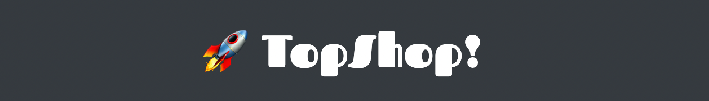

<div style="text-align:center"></div>

# 🧿 TopShop
Basic shop developed with MEAN Stack

This project was generated with [Angular CLI](https://github.com/angular/angular-cli) version 11.2.1.

## Development server
Run `ng serve` for a dev server. Navigate to `http://localhost:4200/`. The app will automatically reload if you change any of the source files.

### Technologies
* 💫 Mongo
* 🔥 Express
* 💣 Angular
* ✨ Node.js

### Funcionality
* Login
* Register

### Dependencies
* validatorjs
* nodemon
* mongodb
* express
* jsonwebtoken

#### Notes about mongoDB
If you installed mongoDB globally you'd have to link it using:
```shell
npm link mongodb
```
  1. Only connect mongodb at the beginning
  2. You get an object that represents the database
     - You ask for the scheme, it is an object that represents the scheme.
  3. You ask the scheme for the collection:
   - It is an object that represents the collection

#### restClient
Include calls to check endpoints